# Práctica 2. Diseño de un modelo de datos en Power Pivot y Creación de elementos visuales

En este laboratorio, comenzarás a desarrollar el modelo de datos. Esto implicará crear relaciones entre tablas y configurar las propiedades de las tablas y columnas para mejorar la facilidad de uso del modelo de datos. Además, creará jerarquías y definirá medidas para análisis avanzados. Como parte adicional, también diseñarás visualmente tablas dinámicas, KPI y gráficos dinámicos para presentar y analizar los datos de manera efectiva.

## Objetivo de la práctica:
Al finalizar la práctica, serás capaz de:

- Crear relaciones.
- Configurar propiedades de tablas y columnas.
- Crear Jerarquías y KPI.
- Crear Tablas Dinámicas.
- Crear Gráficos Dinámicos.

## Duración aproximada:
- 70 minutos.

### Tarea 1. Creación de relaciones.

- Paso 1. De la cinta superior de opciones, selecciona la pestaña **Power Pivot** y luego, en la sección de **Modelo de datos**, selecciona **Administrar**.

    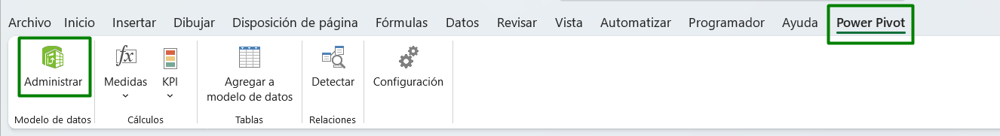 

- Paso 2. En la ventana de Power Pivot, encontrarás una pestaña para cada consulta que creamos en el laboratorio anterior. Dentro de cada una de estas pestañas, podrás ver la información correspondiente a los datos que importamos y transformamos previamente.

    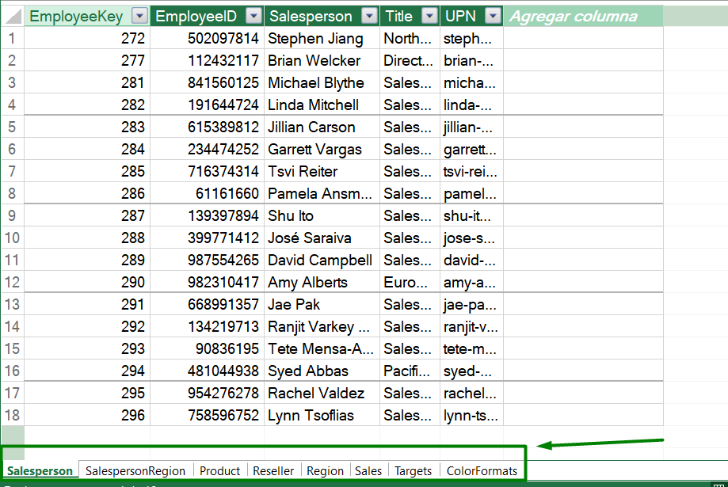 

- Paso 3. Selecciona en la parte superior, en la cinta de opciones, la pestaña **Inicio**. Posteriormente, en la sección **Ver**, haz clic sobre el elemento **Vista de diagrama**.

    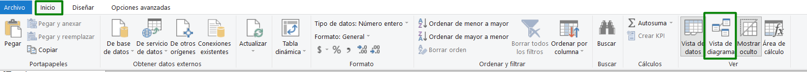 

- Paso 4. En la vista actual del modelo, selecciona en la parte superior la pestaña **Diseñar** y luego haz clic en **Administrar relaciones**. Observa que aún no se ha definido ninguna relación. Para crear una relación, selecciona **Nueva relación**.

- Paso 5. Configura la relación de la tabla de Product a la tabla de Sales. 

    > • En la ventana de **Crear relación**, selecciona la tabla **Product** y luego selecciona la columna **ProductKey**. 

    > • Luego, en la lista desplegable, selecciona **Sales** y asegúrate de que se resalte la columna **ProductKey** correspondiente.  

    > • Ratifica que en la parte inferior izquierda esté marcada la casilla de **Activa**.

    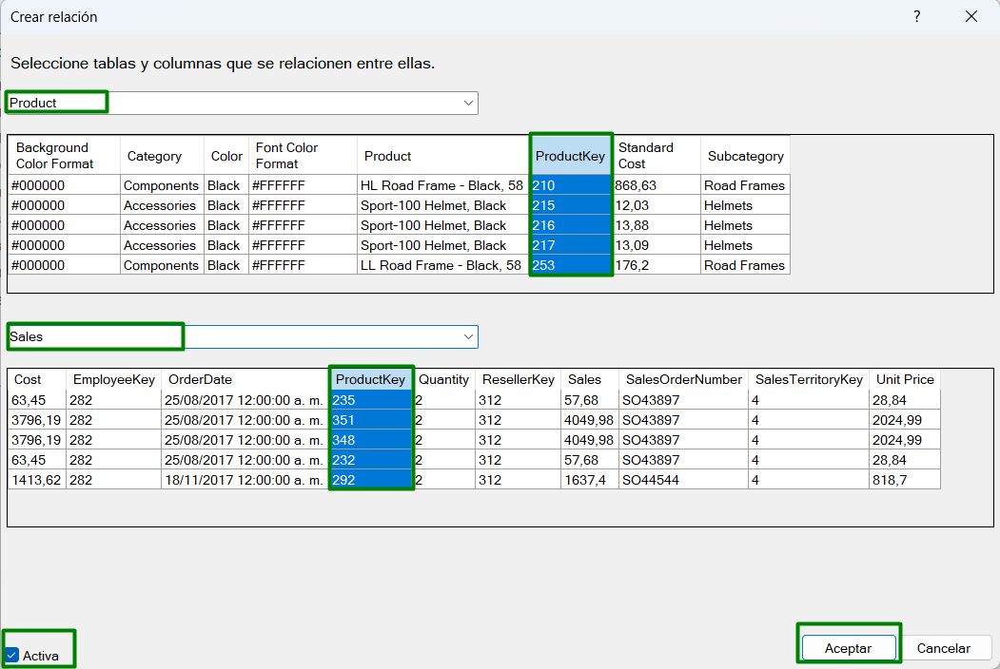 

- Paso 6. Nota que en la vista del modelo, la relación ya aparece creada.

  > • El tipo de cardinalidad es de uno a varios (1:*). La cardinalidad se detectó automáticamente, ya que Power Pivot entiende que la columna **ProductKey** de la tabla **Product** contiene valores únicos. Las relaciones de uno a varios son la cardinalidad más común, y todas las relaciones que cree en este laboratorio serán de este tipo.

  > • El tipo de dirección del filtro cruzado es **Único**.En este caso, significa que los filtros aplicados a la tabla **Product** se propagarán a la tabla **Sales**, pero no en la dirección opuesta.

  > •  Hacer que esta relación esté activa. Las relaciones activas propagan filtros. Es posible marcar una relación como inactiva para que los filtros no se propaguen. Las relaciones inactivas pueden existir cuando hay varias rutas de acceso de relación entre tablas. 

    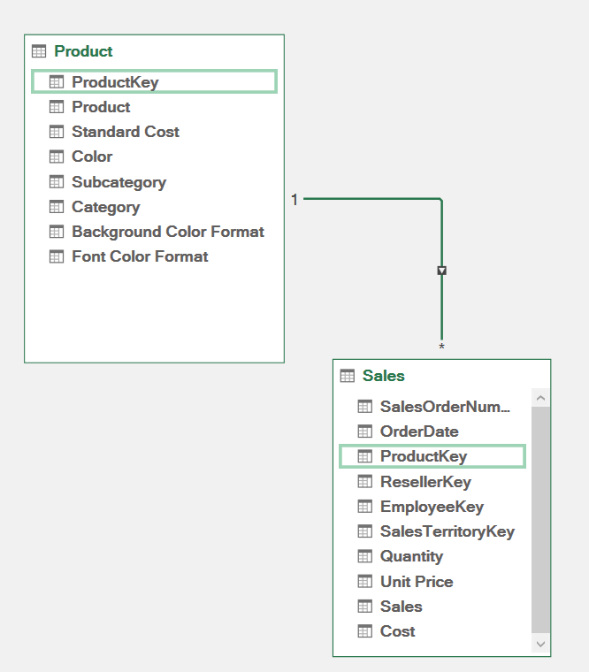 

- Paso 7.  Para crear una nueva relación con una técnica diferente, desde la tabla **Reseller**, arrastra la columna **ResellerKey** a la columna **ResellerKey** de la tabla **Sales**.

    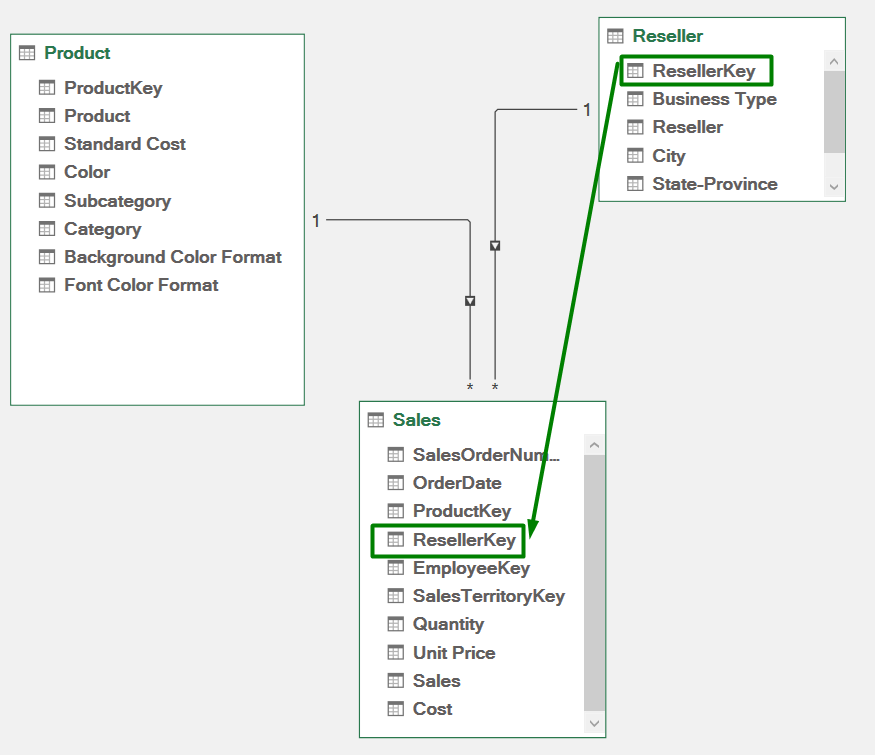 

- Paso 8. Utiliza la nueva técnica para crear las relaciones siguientes:

  > • Region | SalesTerritoryKey --> Sales | SalesTerritoryKey  

  > • Salesperson | EmployeeID --> Targets | EmployeeID

  > • Salesperson | EmployeeKey --> Sales | EmployeeKey 

- Paso 9. En el diagrama, organiza las tablas de modo que la tabla **Sales** se coloque en el centro del diagrama y las tablas relacionadas se organicen a su alrededor. Coloca las tablas desconectadas a un lado.

    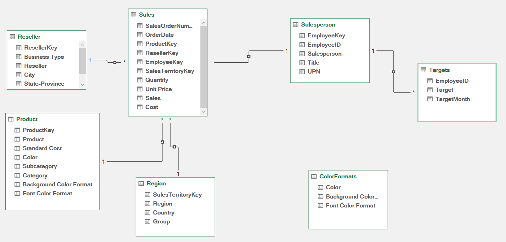 

### Tarea 2. Cargar valores a una tabla dinámicas

- Paso 1. Desde la pestaña superior **Inicio**, selecciona **Tabla dinámica** y luego, nuevamente, haz clic en **Tabla dinámica**.

    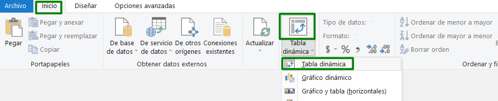 

- Paso 2. En la ventana que aparece, utiliza los valores predeterminados y haz clic en **Aceptar**.

    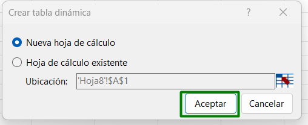  

- Paso 3. Aparecerá la tabla dinámica para que puedas agregar los campos que deseas mostrar.

    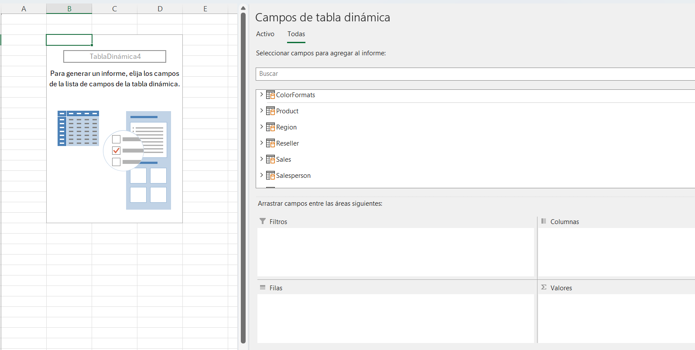  

- Paso 4. Selecciona de **Salesperson** | **Salesperson** y de **Sales | Sales**, en automático crea una suma del campo **Sales**.  
Puedes agregar tambien los campos de **Unit Price** y **Quantity**

    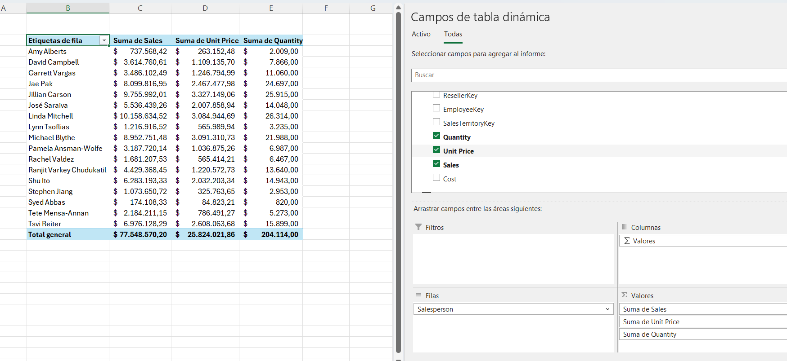  

### Tarea 3. Crear la tabla Fecha

- Paso 1. Cambia a la vista de modelo. En la pestaña de la cinta de opciones **Diseñar**, en el grupo **Calendarios**, selecciona **Tabla de fechas**.

    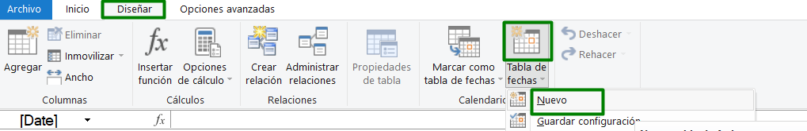  

- Paso 2. Desde la vista de diagrama, notarás que se creó una nueva tabla llamada **Calendario** 

- Paso 3. Relaciona la taba **Calendario** con el modelo

    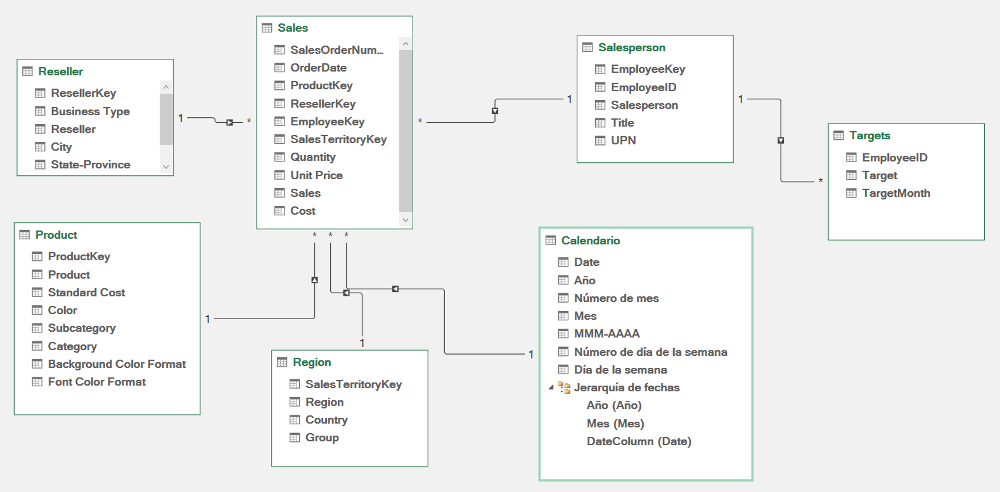  

- Paso 4. Elimina todas las columnas excepto **Date**

    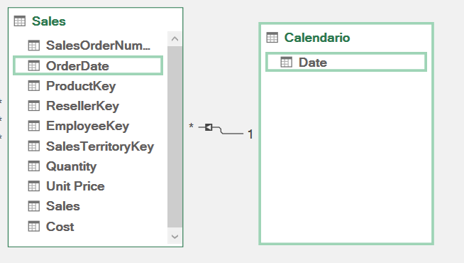  

- Paso 5. Desde la pestaña de **Inicio**, cambia la vista a **Vista de Datos** 

- Paso 6. Valida la información que se creó en automático para la tabla **Calendario**

- Paso 7. En la esquina inferior izquierda, en la barra de estado, observa las estadísticas de la tabla, que confirman que se han generado 1826 filas de datos, lo que representa datos de cinco años completos.

### Tarea 4. Creación de columnas calculadas

En esta tarea, agregarás más columnas para habilitar el filtrado y la agrupación por diferentes períodos de tiempo.

- Paso 1. En la ventana de **Power Pivot**, en la sección **Ver**, selecciona **Vista de datos**.

    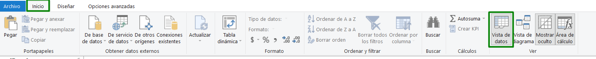  

- Paso 2. En la parte inferior, selecciona la tabla **Calendario**.

- Paso 3. Agrega una nueva columna **Año** con la siguiente expresion, que concatena un texto:

   > ="FY" & YEAR('Calendario'[Date]) + IF (MONTH(Calendario[Date]) > 6; 1)

    *La fórmula utiliza el valor del año de la fecha, pero agrega uno al valor del año cuando el mes es posterior a junio. Así es como se calculan los años fiscales en este escenario.*

- Paso 4. Renombre la **Columna calculada 1** por **Año**

- Paso 5. Agrega una nueva columna con la siguiente DAX para el **Trimestre**:

    >= 'Calendario'[Año] & " T" &  
        >IF(MONTH(Calendario[Date]) <= 3;3;  
            IF(MONTH(Calendario[Date]) <= 6;4;  
            IF(MONTH(Calendario[Date]) <= 9;1;2
            )
        )
    )

- Paso 6. Renombra la **Columna calculada 1** por **Trimestre**

    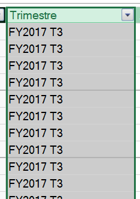  

- Paso 7. Agrega una columna **Mes** con la siguiente DAX:

    > = FORMAT(Calendario[Date] ;"YYYY - MMM")

- Paso 8. Renombra la **Columna calculada 1** por **Mes**

- Paso 9. Para ordenar de acuerdo a los meses dentro del Año Fiscal, agrega una columna con el numero del mes:

    >= (YEAR(Calendario[Date]) * 100) + MONTH(Calendario[Date])

- Paso 10. Renombra la  **Columna calculada 1** por **Número del mes**

    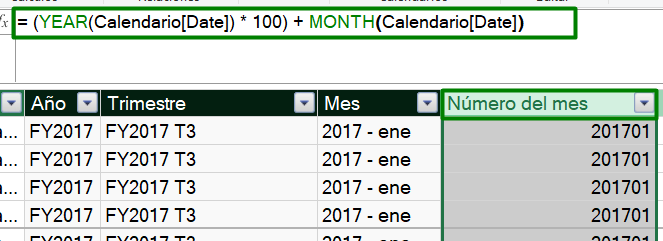  

- Paso 11. Agrega los años y meses en una tabla dinámica y observa que los meses no tienen un orden correcto.

    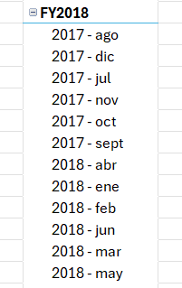 

- Paso 12. Para ordenarlos, utiliza la columna que creaste anteriormente con el número del mes. En la ventana de **Power Pivot**, selecciona el encabezado de la columna **Mes** y, en la parte superior, en la pestaña **Inicio**, selecciona **Ordenar Por**.

    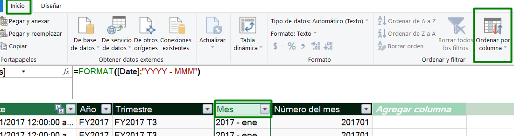 

- Paso 11. En la nueva ventana, selecciona la columna **Numero de mes** y después **Aceptar**

- Paso 12. Reguesa a la tabla dinámica y verifica el orden correcto de acuerdo con el año fiscal.

    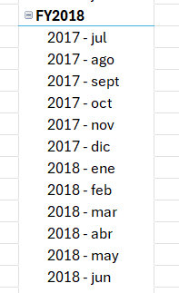 

### Tarea 5. Crear Jerarquia

- Paso 1. En Power Pivot regresa a la vista de diagrama y selecciona la tabla **Calendario**

- Paso 2. Nota que en la parte superiro derecha aparece un ícono de jerarquía, seleccioná este elemento.

    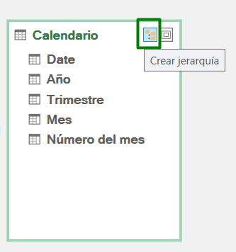 

- Paso 3. Nombra la jerarquia con **Fiscal** y después, dentro de ese elemento, arrastrá los campos de **Año**, **Trimestre** y **Mes** 

    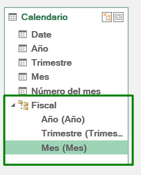 

### Tarea 6. Cree medidas sencillas

- Paso 1. En Excel, en la parte superior en la pestaña de **Power Pivot**, selecciona **Medidas** y **Nueva medida**

    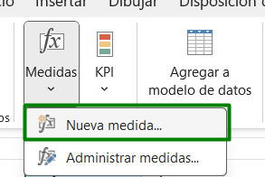 

- Paso 2.Selecciona en:

    > Nombre de la tabla: **Sales**   
    > Nombre de la medida: **Promedio Precio**  
    > DAX:  = AVERAGE(Sales[Unit Price]).
    > Categoría: **Moneda**

    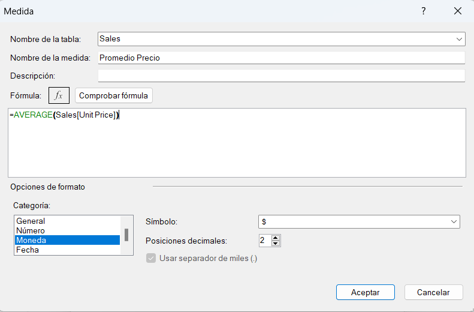 

- Paso 4. Realiza el mismo proceso para las siguientes medidas:

    > - Precio Medio =MEDIAN(Sales[Unit Price])  
    > - Precio mínimo =MIN(Sales[Unit Price])  
    > - Precio máximo =MAX(Sales[Unit Price]) 
    > - Órdenes = DISTINCTCOUNT(Sales[SalesOrderNumber]) 
    > - Líneas de pedido =COUNTROWS(Sales)  
    > - Doble de Ordenes = 2 * CALCULATE( DISTINCTCOUNT(Sales[SalesOrderNumber]); SAMEPERIODLASTYEAR(Calendario[Date]))

    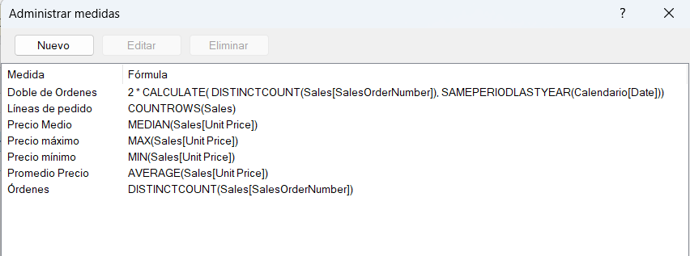 

   
- Paso 5. Agrega cada medida a la tabla dinamica.

    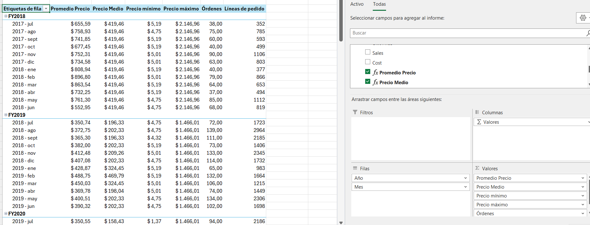 

### Tarea 7. Crear KPI

- Paso 1. En Excel, en la parte superior en la pestaña de **Power Pivot**, selecciona **KPI** y **Nuevo KPI**

- Paso 2. Utiliza la medida que configuraste en el paso anterior **Doble de Ordenes** para generar un KPI que me permita como objetivo o destino considerar el doble de ordenes frente al año anterior.

- Paso 3. En el KPI, selecciona en los campos:

    >- Campo base de KPI: **Órdenes**
    >- Medida: Doble de Ordenes

    Las demás configuraciones puede dejarlas por default y selecciona **Aceptar**.

- Paso 4. Agrega el KPI al inicio en la tabla dinamica y podra ver los íconos correspondientes

    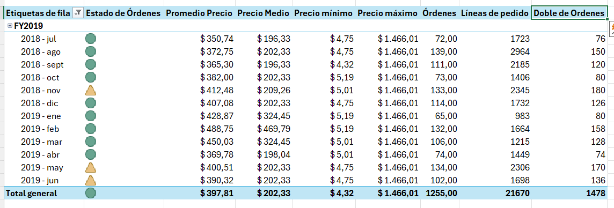 

### Tarea 8. Crear Gráficos dinámicos

- Paso 1. En Excel, en la pestaña de **Insertar** en la sección de **Gráficos**, selecciona **Gráfico dinámico**. 

    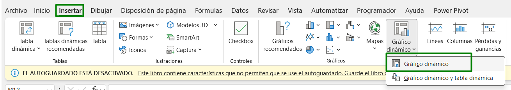 

- Paso 2. En el elemento agregado, selecciona los campos para exponer la información. En Ejes selecciona el **Category**  y en Valores agrega a **Sales**

    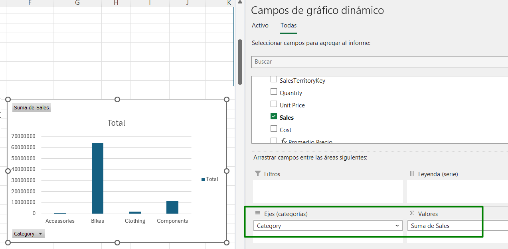 

- Paso 3. Agrega una segmentación por Años y edítala para que pueda filtrar ambos objetos visuales.

### Resultado final
Con lo realizado, tendrás un modelo relacional que permite crear diferentes objetos visuales para analizar la información de manera más detallada y eficiente.

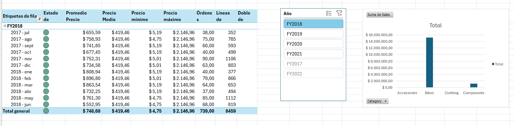 
